# Why do most LLMs now adopt decoder-only architecture?

### Speaker: 黎亚轩

### Date: 2025-03-20

---

# Start from traditional transformer architecture

- Transformer: encoder-decoder architecture

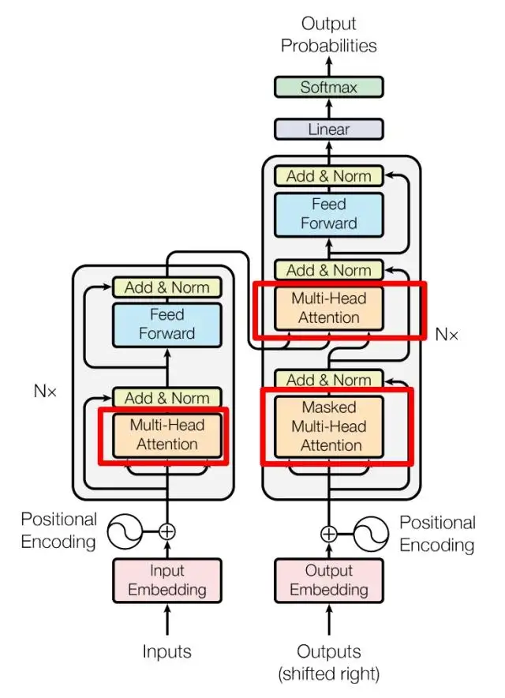

---

- Encoder block is used to encode the input sequence and abstract the information.
- Decoder block is used to decode the output sequence.
- Used in machine translation, text abstractive summarization, etc.

---

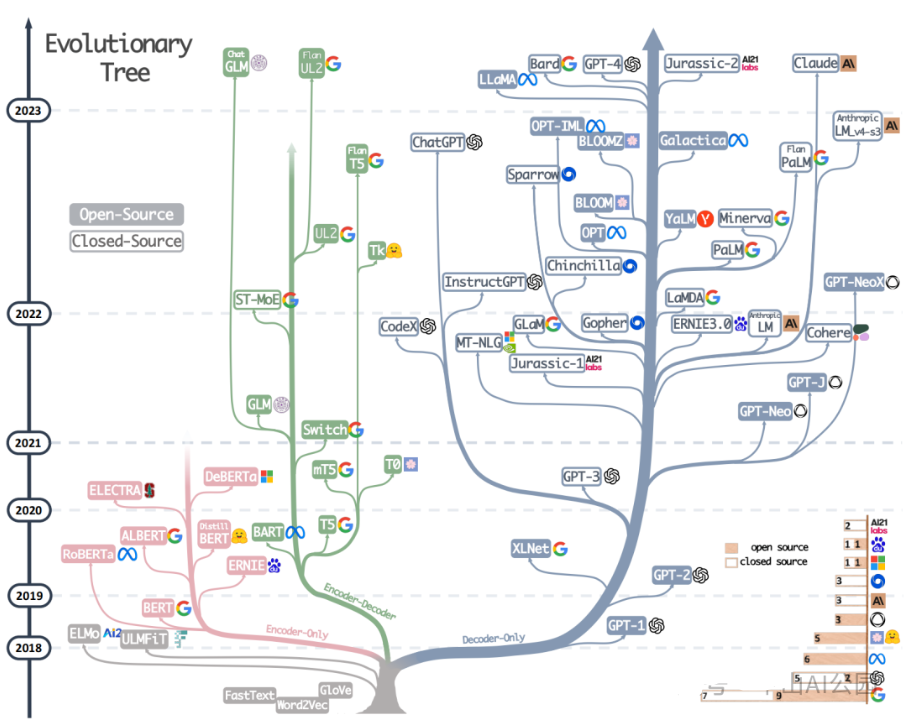

---

# Decoder-only architecture

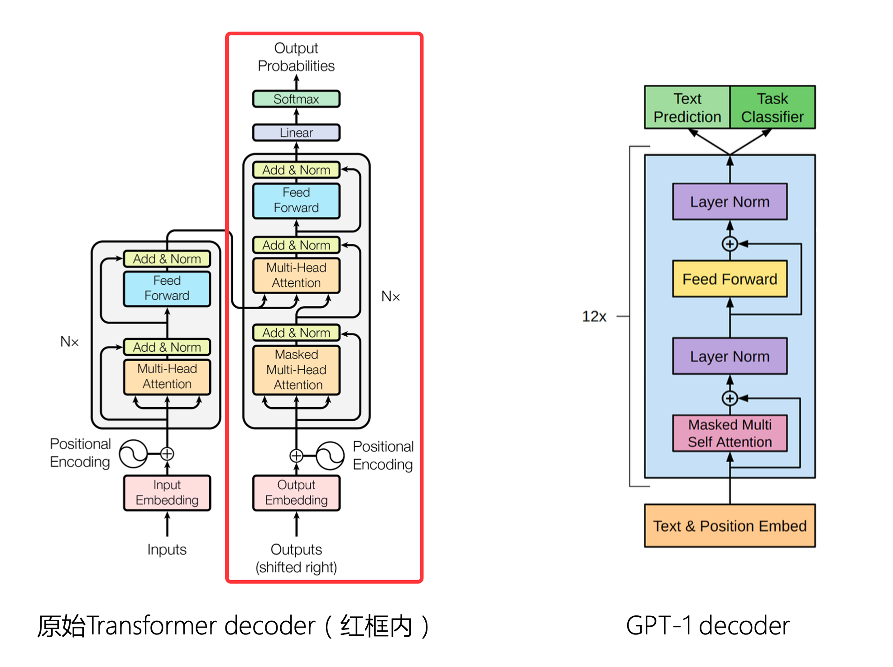

---

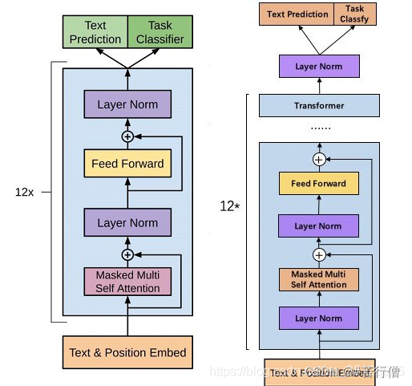

- Left is GPT-1, right is GPT-2

- LayerNorm的位置不同，将layer norm放在了每个残差块里面，这样的操作在实验中证明是为了减少预训练过程中各层之间的方差变化，使梯度更加稳定

---

# Encode-only architecture

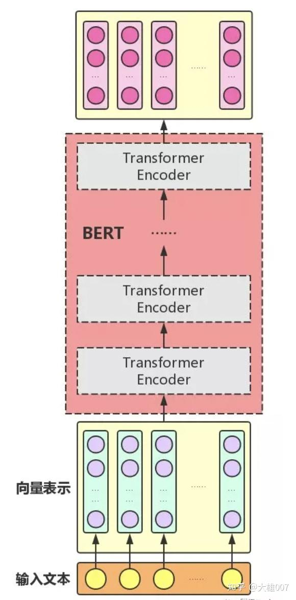

---

# Advantages of decoder-only architecture

## From the mathematical perspective

$$
\operatorname{Attention}(Q, K, V)=\operatorname{softmax}\left(\frac{Q K^{T}}{\sqrt{d_{k}}}\right) V
$$

- Attention矩阵通常通过低秩分解得到，具体是由一个$n \times d$ 的矩阵与一个 $d \times n$ 的矩阵相乘后再应用softmax函数（其中$n \gg d$）。这种形式的Attention矩阵由于低秩性质，其表达能力会下降。详细分析可参考论文 **《Attention is Not All You Need: Pure Attention Loses Rank Doubly Exponentially with Depth》**  。

- 论文的主要结论：自注意力网络的输出（矩阵）（按深度）**指数级**地收敛到秩为1（例如各行内容都一样）的矩阵，从而使所有的token都一样了（即每个token都拥有类似的向量表示；一行对应一个token）

---

## From vector space perspective to understand

- 在Encoder的双向注意力中，每个词元可以同时关注前后所有位置的词元。在多层堆叠后，不同位置的注意力权重逐渐趋同（即关注相似的上下文），线性相关的程度上升，导致注意力矩阵的秩随网络深度指数级下降。

## Disadvantage of low-rank attention matrix

- **低秩**相当于所包含的「独立信息」较少，可以通过少数几个向量的组合来近似表示
- 模型丢失了大量文本的信息，无法捕捉到足够的表示能力，影响模型的性能

---

## Decoder-only架构的Attention矩阵

Decoder-only架构中的Attention矩阵是一个下三角矩阵。下三角矩阵的行列式等于其对角线元素的乘积。由于softmax函数的性质，对角线元素均为正数，因此该矩阵的行列式也为正数。这意味着Decoder-only架构的Attention矩阵一定是**满秩**的。满秩特性赋予了该矩阵更强的理论表达能力，表明Decoder-only架构在理论上比双向注意力机制具有更强的表达能力。

$$
softmax = \frac{e^{x_i}}{\sum_{j=1}^{n} e^{x_j}}
$$

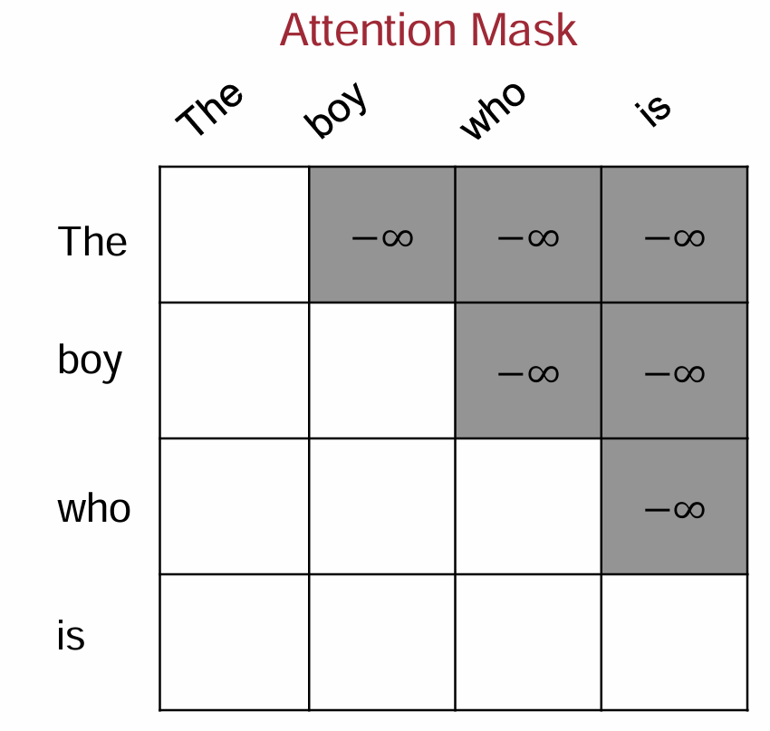

---

## From the perspective of pre-training task complexity

### Pre-training task of BERT

- MLM（Masked Language Model）：随机mask掉一部分token，预测被mask掉的token
- NSP（Next Sentence Prediction）：判断句子B是否是句子A的下一句

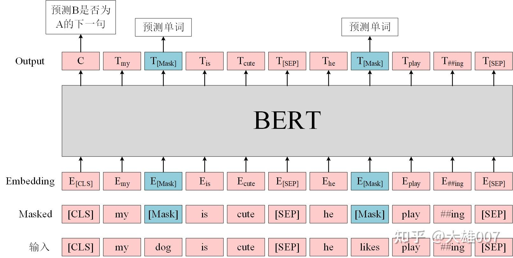

---

## From the perspective of pre-training task complexity

- BERT的双向模型可以看到前向和后向，这在预测的时候是天然的优势，但在训练的时候其实反而降低了学习难度，自回归模型的最难任务还是会比双向模型的最难任务要难得多(写作文本来也比完形填空要难)。

- 纯粹的decoder-only架构+next token predicition预训练，每个位置所能接触的信息比其他架构少，要预测下一个token难度更高，当模型足够大，数据足够多的时候，decoder-only模型学习通用表征的上限更高

---

## Better zero-shot/few-shot generalization performance

- [What Language Model Architecture and Pretraining Objective Work Best for
 Zero-Shot Generalization?](https://proceedings.mlr.press/v162/wang22u/wang22u.pdf) 在最大5B参数量、170B token数据量的规模下做了一些列实验，发现用next token prediction预训练的decoder-only模型在各种下游任务上zero-shot泛化性能最好

- 在实际使用LLM时，我们经常会加入Chain-of-Thought或者In-Context信息来作为prompt进一步激发模型潜力——例如加入一些例句让GPT类模型来模仿、生成更好的结果。[Why Can GPT Learn In-Context? Language Models Implicitly Perform Gradient Descent as Meta-Optimizers](https://arxiv.org/pdf/2212.10559)指出In-Context信息可以视为一种task finetuning, decoder-only的架构相比encoder-decoder在In-Context的学习上会更有优势，因为前者的prompt可以更加直接地作用于decoder每一层的参数，微调信号更强。

---

## From the perspective of model efficiency

- 随着对话轮数的增加，请求长度变长，导致模型的First Token Time（下称FTT）不断变长

- Decoder-only由于Attention Mask都是下三角矩阵：即某一位置token的注意力与后续token无关，因此在多轮对话中KV cache可以被重复利用，减少计算量: 保存上一轮对话产生的KV cache，供下一轮对话时复用，就能减少下一轮需要生成KV cache的token数，从而减少FTT

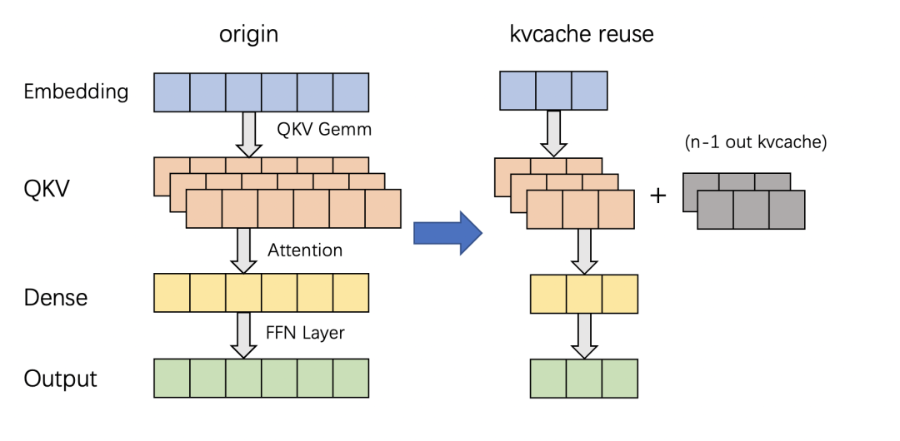

---

## Return to essence: from the perspective of path dependence

- GPT效果好

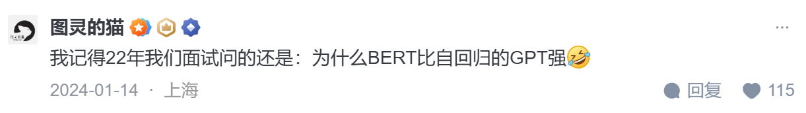

---

## Return to essence: from the perspective of path dependence

- OpenAI作为开拓者勇于挖坑踩坑，以decoder-only架构为基础摸索出了一套行之有效的训练方法和Scaling Law，后来者鉴于时间和计算成本，自然不愿意做太多结构上的大改动，继续沿用decoder-only架构。在工程生态上，decoder-only架构也形成了先发优势，Megatron和flash attention等重要工具对causal attention的支持更好。

---

# The current trend: Modifying the decoder-only architecture for enhanced performance

### MOE Architecture: Take Deepseek V3 as an example

- MOE: Mixture-of-Experts(混合专家模型)

- 起源于1991 年的论文[Mixture-of-Experts for Classification](https://ieeexplore.ieee.org/abstract/document/6797059)

- Switch Transformer, GPT4, Deepseek V3等模型都采用了MOE架构

- 正交于传统的encoder-decoder架构和decoder-only架构

---

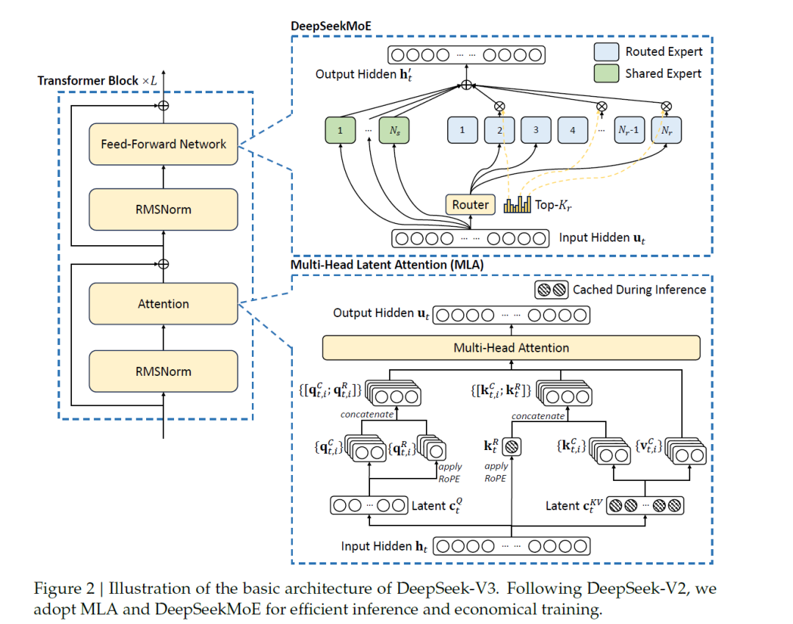

---

- Experts: 每个专家是一个独立的子网络（通常是 FFN），在实际计算中**只有部分专家会被激活参与处理**。通过让多个专家分担不同数据子集的计算，模型在预训练时可以以较低的计算开销获得大参数量带来的表示能力 (这也就是为什么671B的参数，为什么只有37B激活)

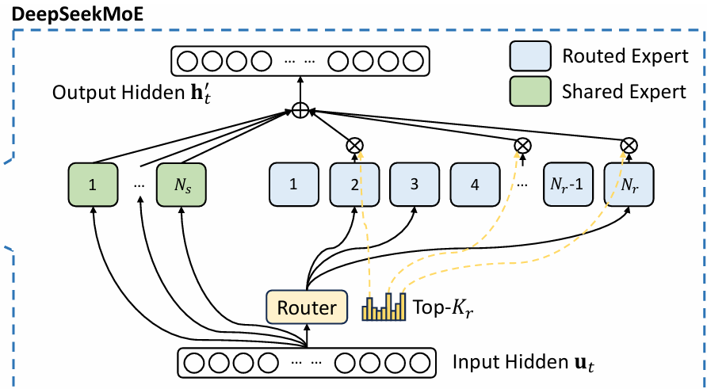

---

- Router: 负责根据输入 token 的特征动态选择激活哪些专家。门控网络一般采用一个带 softmax 的简单前馈网络来计算每个专家的权重。经过训练后，门控网络会逐步学会将相似的输入路由到表现更好的专家​。

---

- 每个 token 的路由决策是独立计算的，也就是说，在一次交互中，每个 token 都会经过门控网络单独计算其路由概率，然后根据其自身的特征分配到最合适的一个或多个专家上。结果可能是不同的 token 被分配给不同的专家

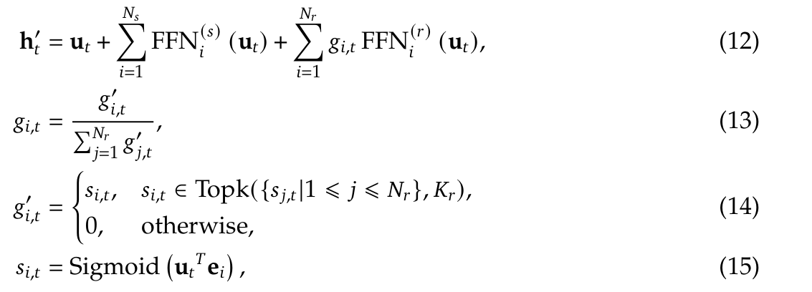

---

## Domain-expert assignment

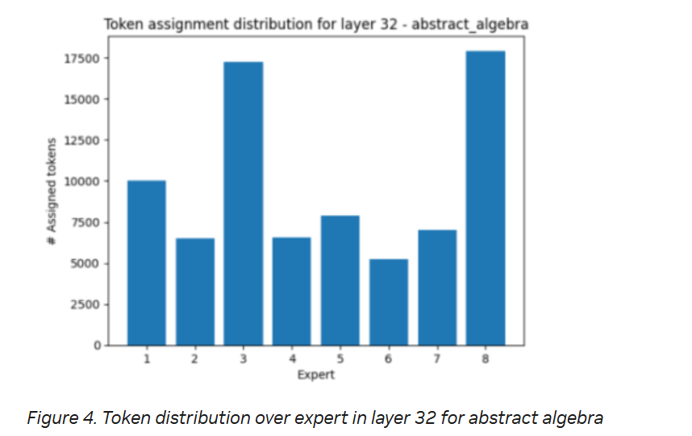
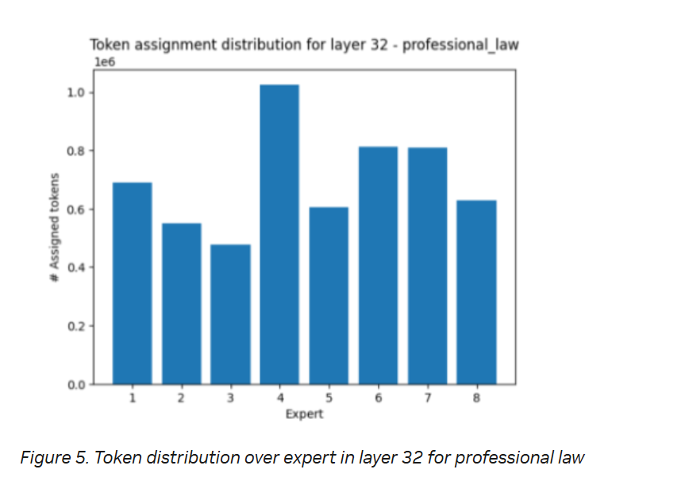

---

## Most preferred tokens by experts

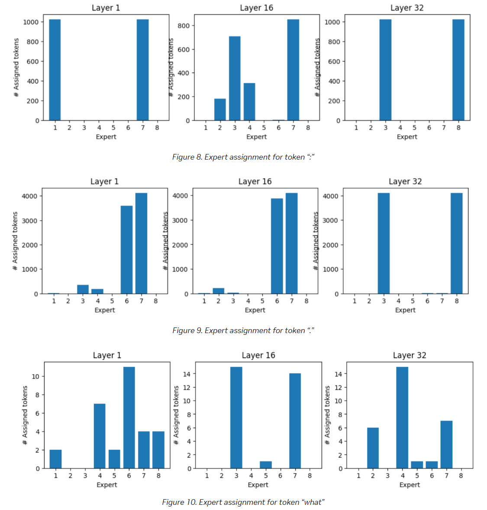

---

## Evaluation

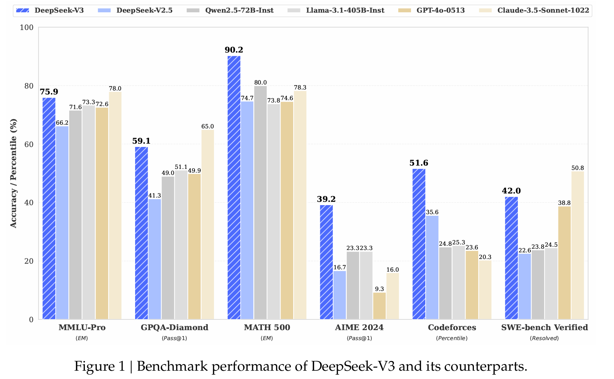

---

# Thank you for your listening
